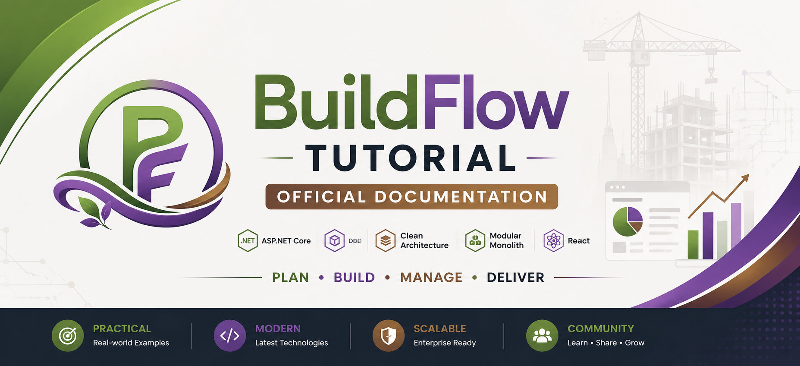
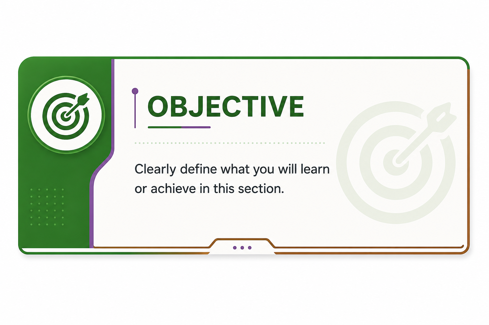
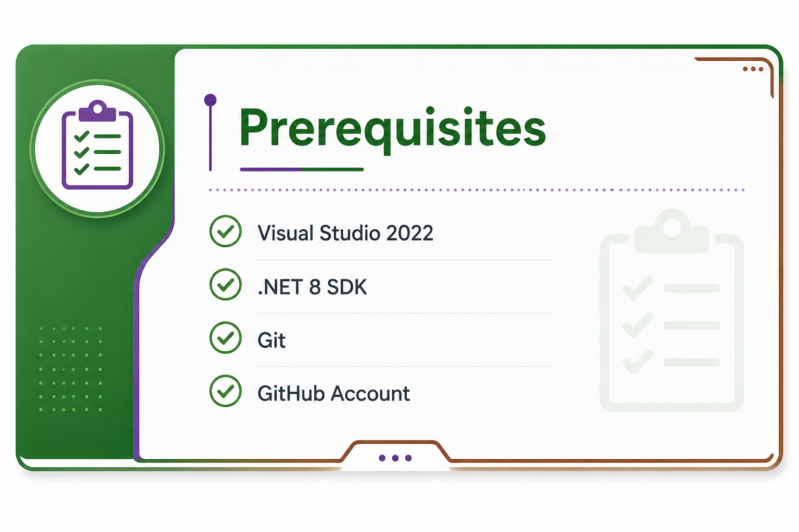
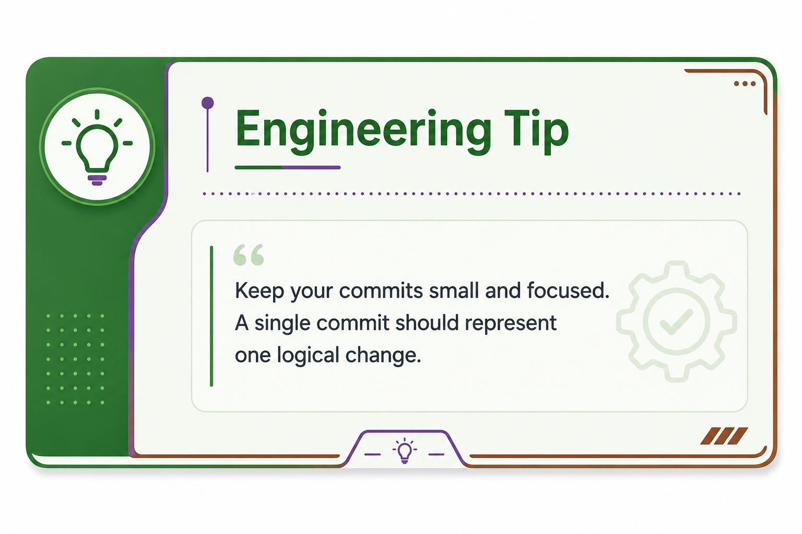
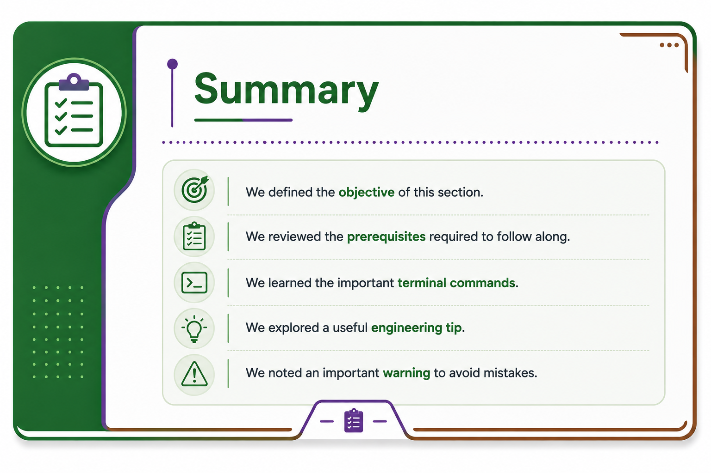
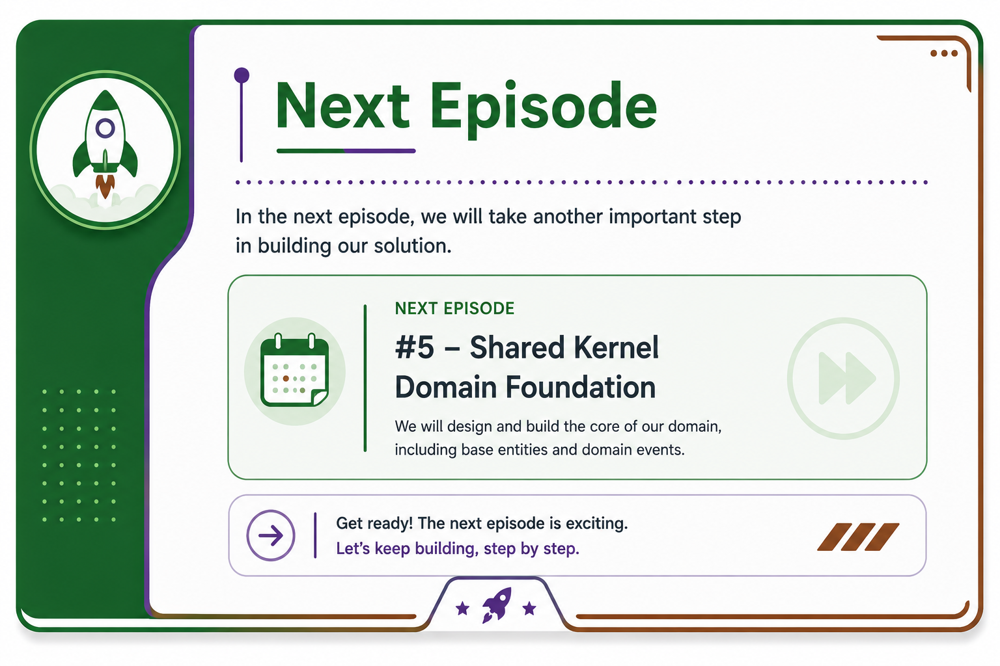

  

  

# BuildFlow Tutorial Series

# Episode 01

# Architecture: Why Modular Monolith & Domain-Driven Design?

> Learn **why** we chose this architecture before writing a single line of code.

---

## 📺 Related Video

**BuildFlow #01 — Architecture: Why Modular Monolith & DDD?**

🎥 YouTube

> https://www.youtube.com/watch?v=XXXXXXXXXXX

---

  

### In this chapter you will learn

- Why BuildFlow is built as an Enterprise SaaS application.
- Why we chose **Modular Monolith** instead of Microservices.
- Why **Domain-Driven Design (DDD)** is the foundation of the project.
- The long-term vision of the BuildFlow architecture.

---

  

Before starting this chapter, you should have:

- Basic knowledge of C#
- Basic knowledge of .NET
- Visual Studio 2022 installed
- .NET 8 SDK installed
- Git installed

---

# Introduction

Every successful enterprise application starts with the right architecture.

Many developers begin writing code immediately and think about architecture later.

In real-world enterprise systems, this usually leads to technical debt, difficult maintenance, and expensive redesigns.

That is why the first episode of BuildFlow focuses entirely on architecture before creating the first project.

---

# Why BuildFlow?

BuildFlow is not a demo project.

It is a real Enterprise SaaS application built to demonstrate modern software engineering practices used in production systems.

Throughout this tutorial series, we will build the application step by step using modern architectural principles.

---

# Why Modular Monolith?

Instead of starting with Microservices, we intentionally choose Modular Monolith because it provides:

- Simpler deployment
- Lower operational cost
- Easier debugging
- High maintainability
- Excellent scalability for most enterprise systems

Later, the system can evolve into Microservices if business requirements justify it.

---

# Why Domain-Driven Design?

DDD helps us organize business logic around the domain rather than technical layers.

Benefits include:

- Rich business models
- Better maintainability
- Clear boundaries
- Easier collaboration between developers and domain experts

DDD is the backbone of BuildFlow.

---

  

> Architecture decisions made at the beginning of a project often determine how easy the next five years of development will be.

---

  

In this chapter we learned:

- Why architecture matters.
- Why BuildFlow uses Modular Monolith.
- Why DDD is the project's foundation.
- What to expect throughout this tutorial series.

---

  

In the next chapter we will build the **SharedKernel**, which becomes the heart of the entire application.

---

# 🔗 Continue Your Learning

## 💻 BuildFlow-Tutorial Repository

https://github.com/luaay/BuildFlow-Tutorial

---

## 🚀 BuildFlow-V3 Repository

https://github.com/luaay/BuildFlow-V3

---

## 🌐 Live Demo

https://buildflow.runasp.net/swagger/index.html

---

## 🎥 YouTube Playlist

https://www.youtube.com/watch?v=BtDY8nP7s-s&list=PLvQd5bL8gZSsOxYZfdleDcERevGIcvYbm

---

# BuildFlow Tutorial Series

Copyright © 2026 **Luay H.**

All rights reserved.